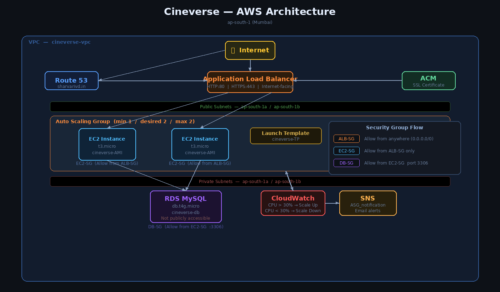
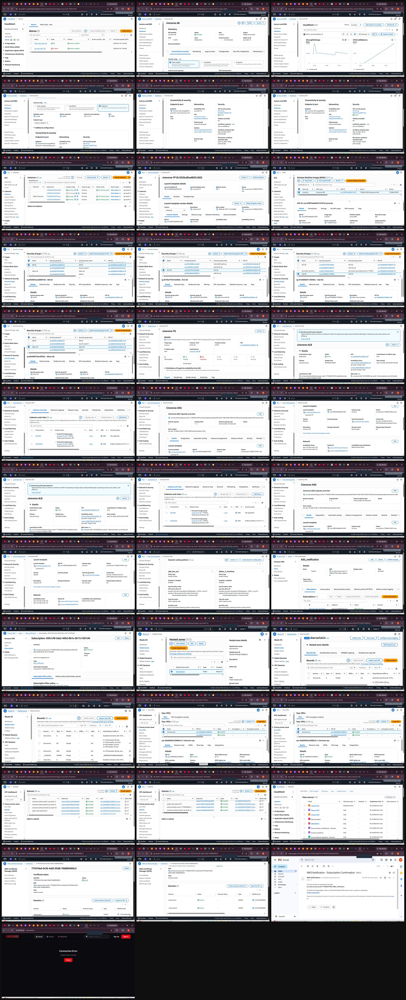

# 🎬 Cineverse — AWS Cloud Deployment

Cineverse is a full-stack movie browsing web application. This project covers deploying it end-to-end on AWS — from networking and compute to database, SSL, DNS, auto scaling, and monitoring — entirely through the AWS Management Console.

**Region:** ap-south-1 (Mumbai)

---

## 🏗️ Architecture

---

## ☁️ Services Used

`EC2` &nbsp; `RDS MySQL` &nbsp; `ALB` &nbsp; `Auto Scaling` &nbsp; `VPC` &nbsp; `Route 53` &nbsp; `ACM` &nbsp; `SNS` &nbsp; `CloudWatch`

---

## 🔨 What I Did — Step by Step

### 1. VPC & Networking
- Created a custom VPC (`cineverse-vpc`) with both **public and private subnets** across two Availability Zones (ap-south-1a and ap-south-1b)
- Set up an **Internet Gateway** and configured **route tables** so public subnets can reach the internet while private subnets stay isolated
- Created all necessary **security groups** with least-privilege rules:
  - `ALB-SG` — allows traffic from anywhere on port 80/443
  - `EC2-SG` — only allows traffic from ALB-SG
  - `DB-SG` — only allows MySQL (port 3306) from EC2-SG

### 2. RDS Database
- Launched a **MySQL RDS instance** (`cineverse-db`, db.t4g.micro) inside the **private subnet**
- Disabled public access so the database is only reachable from EC2 instances inside the VPC
- Placed it in its own **subnet group** (`cineverse-db-group`) spanning both AZs

### 3. EC2 & Custom AMI
- Launched an EC2 instance, installed the application, configured environment variables and database connection
- Once the app was working, created a **custom AMI** (`cineverse-AMI`) from that instance so it can be reused for scaling
- Built a **Launch Template** (`cineverse-TP`) using the custom AMI and t3.micro instance type

### 4. Application Load Balancer
- Created an **internet-facing ALB** (`cineverse-ALB`) deployed across both public subnets
- Set up a **Target Group** (`cineverse-TG`) using HTTP on port 80
- Added two listeners: **HTTP:80** and **HTTPS:443**, both forwarding to the target group

### 5. Auto Scaling Group
- Created an **Auto Scaling Group** (`Cineverse-ASG`) using the Launch Template
- Set desired capacity to **2**, with a min of 1 and max of 2
- Configured it to span both availability zones for fault tolerance
- Attached the ASG to the ALB target group so new instances automatically register

### 6. CloudWatch Alarms & Dynamic Scaling
- Created two **CloudWatch alarms** monitoring CPU utilization on the ASG:
  - `CPU_more_than_30` — triggers when CPU > 30% for 30 seconds
  - `cpu_less_than_30` — triggers when CPU < 30% for 30 seconds
- Created two **dynamic scaling policies**:
  - `add_one_ec2` — adds 2 capacity units when CPU is high, waits 80s before next action
  - `delete_2_machines` — removes capacity when CPU is low, waits 60s before next action

### 7. SNS Notifications
- Created an **SNS topic** (`ASG_notification`) to receive scaling event alerts
- Subscribed an email address and confirmed the subscription
- Linked the topic to the ASG so an email is sent every time a scale-up or scale-down happens

### 8. SSL Certificate & Custom Domain
- Requested a **public SSL certificate** from ACM covering `sharvarivd.in` and `*.sharvarivd.in`
- Validated ownership via **DNS validation** — added the CNAME records to Route 53
- Certificate status changed to **Issued** once DNS propagated

### 9. Route 53 — Custom Domain
- Created a **hosted zone** in Route 53 for `sharvarivd.in`
- Added an **A record** (alias) pointing `sharvarivd.in` and `www.sharvarivd.in` to the ALB DNS name
- Traffic to the domain now routes through the load balancer and hits healthy EC2 instances

---

## 📸 Screenshots

